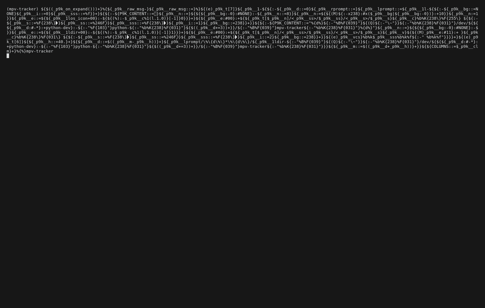
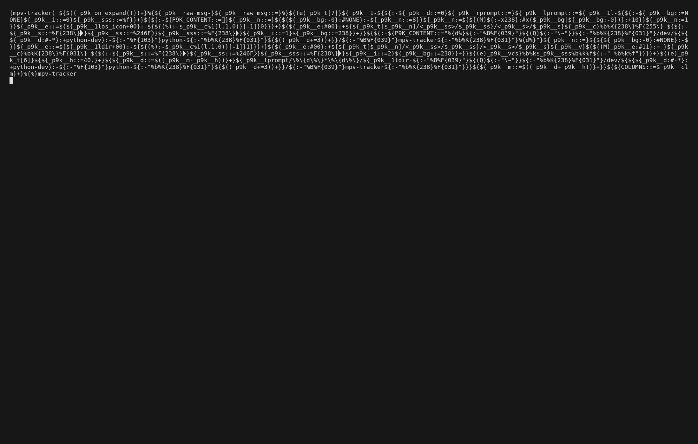

# MPV Tracker

Terminal UI and CLI tool for tracking watched episodes in local series or anime
directories.

It keeps a global library index in SQLite and writes per-series playback state
inside the tracked directory itself in `.mpv-tracker.json`.

## Links

- PyPI: https://pypi.org/project/mpv-tracker/
- Project metadata: [pyproject.toml](pyproject.toml)
- README: [README.md](README.md)

## Installation

Python 3.12 or newer is required.

### Run Without Installing Globally

Use `uvx` to run the latest published version directly:

```bash
uvx mpv-tracker
```

### Install With pipx

`pipx` is a good fit if you want an isolated global command:

```bash
pipx install mpv-tracker
mpv-tracker
```

### Install With pip

If you prefer plain `pip`, install the package into your current environment:

```bash
pip install mpv-tracker
mpv-tracker
```

If you want a user-local install without `pipx`, you can also use:

```bash
python -m pip install --user mpv-tracker
mpv-tracker
```

## TUI

Run `mpv-tracker` with no arguments to open the Textual interface.

The TUI is built around a few main screens:

- `Library`: browse tracked series, open details, add/edit/remove entries, open
  MAL account settings, and open application settings.
- `Series Detail`: inspect watched count, resume state, MAL linkage, playback
  preferences, and episode-level progress.
- `MAL`: authenticate in the browser, inspect the current MAL account, and
  manage linked anime metadata.

Typical workflow:

1. Launch the app with `mpv-tracker`
2. Press `a` to add a series directory
3. Press `Enter` on a series to open the detail view
4. Select an episode and press `p` or `Enter` to play it with `mpv`
5. Return to the detail view to inspect updated progress, MAL metadata, and
   score controls

Useful TUI features:

- Per-series chapter-start preferences for fresh episodes
- MAL browser authentication from inside the TUI
- Linked MAL anime metadata with cached score, rank, popularity, synopsis,
  titles, genres, studios, and related info
- Direct MAL score updates from the detail view
- Browser-open actions for MAL profile and anime pages
- Built-in help screen on `h` or `?`

Progress is persisted through the same `.mpv-tracker.json` state file used by
the CLI.


### Showcase



### Add Series



### MAL Auth


## Demo

This repo includes `vhs` tapes you can use to generate short terminal demos:

- `demo/showcase.tape`: main TUI flow using a tracked MAL-linked series
- `demo/mal-auth.tape`: MAL settings/authentication screen walkthrough
- `demo/add-series.tape`: add a new MAL-linked series from inside the TUI

Example commands:

```bash
vhs demo/showcase.tape
vhs demo/mal-auth.tape
vhs demo/add-series.tape
```

## CLI Commands

`add`

- Prompts for title, directory, and optional slug when not passed as arguments.
- Stores the tracked series in a SQLite library database.

`list`

- Shows every tracked series with watched episode count vs total discovered files.
- Shows the currently resumed episode and time offset when present.

`watch <slug> [episode]`

- Resolves the tracked series by slug.
- Starts `mpv` on the tracked directory as a playlist and jumps to the resumed
  episode, next unwatched episode, or the explicitly selected episode.
- Polls MPV over its IPC socket and updates `.mpv-tracker.json` roughly once per
  second so resume data survives abrupt closes.

Episode discovery currently scans only the top level of the tracked directory
and sorts video files by filename.

## Development

This project uses [uv](https://github.com/astral-sh/uv) for dependency and virtualenv management. Useful commands:

- Create/activate a virtualenv and install dependencies: `uv sync`
- Run the linter: `uv run ruff check`
- Run type checks: `uv run mypy`
- Install local helpers: `uv sync --group local`
- Run everything in one go: `uv run ruff check && uv run mypy`

## Pre-commit

```bash
uv run prek install
```

## Packaging

Builds are handled by `hatchling` through `uv`:

```bash
uv build
```
